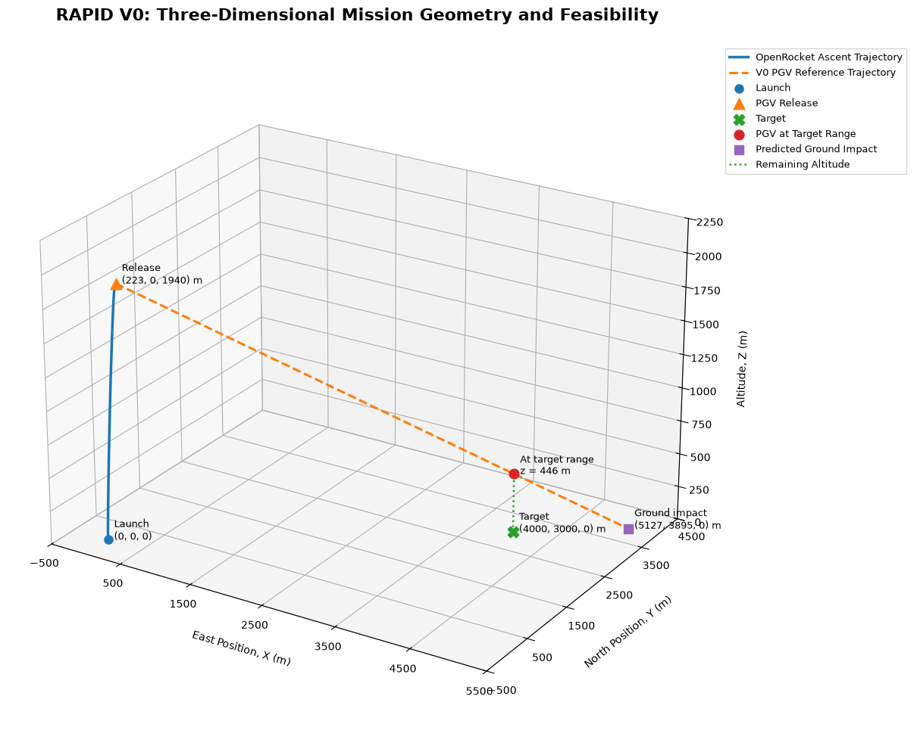
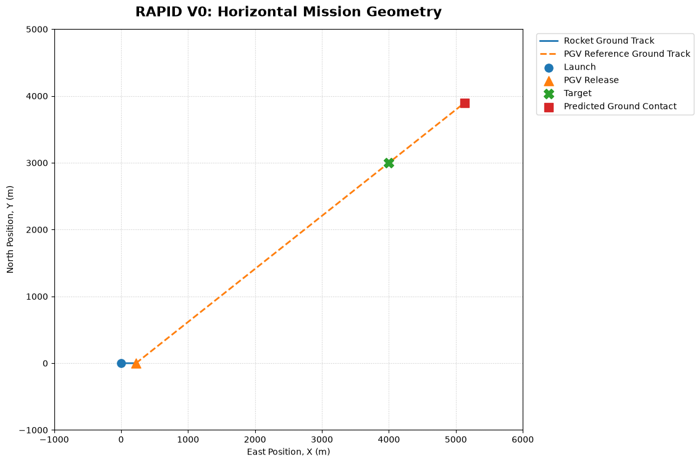
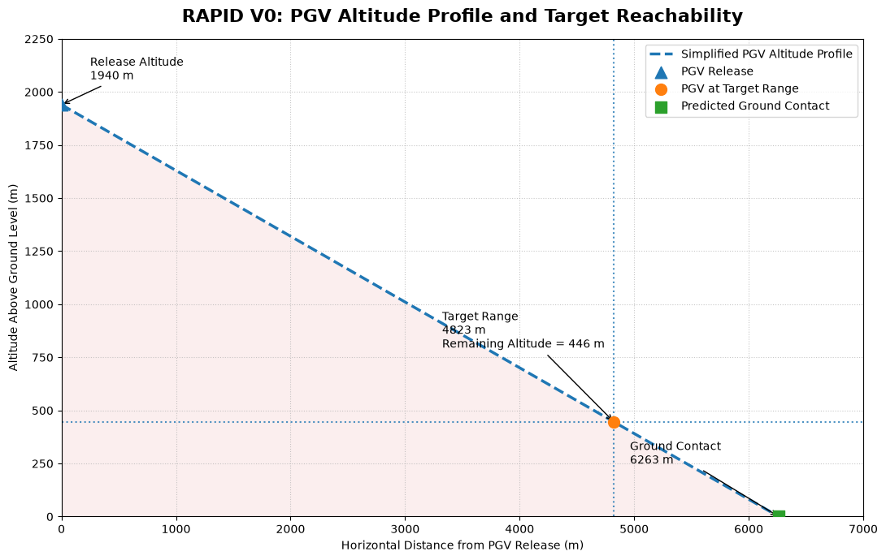
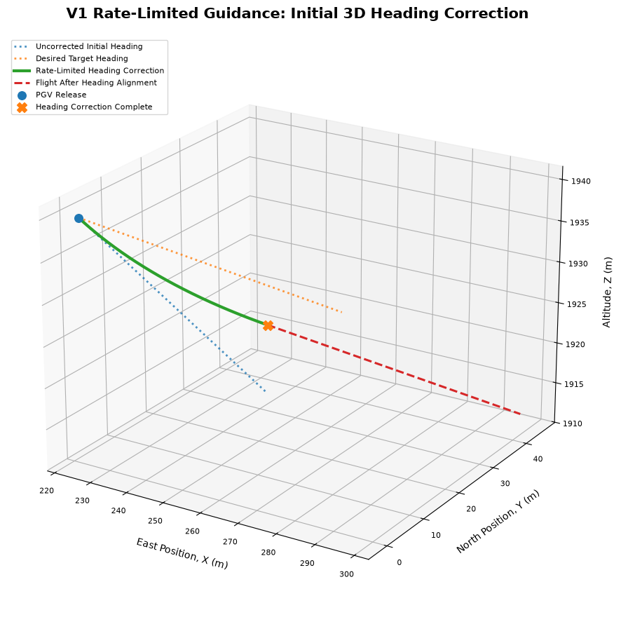
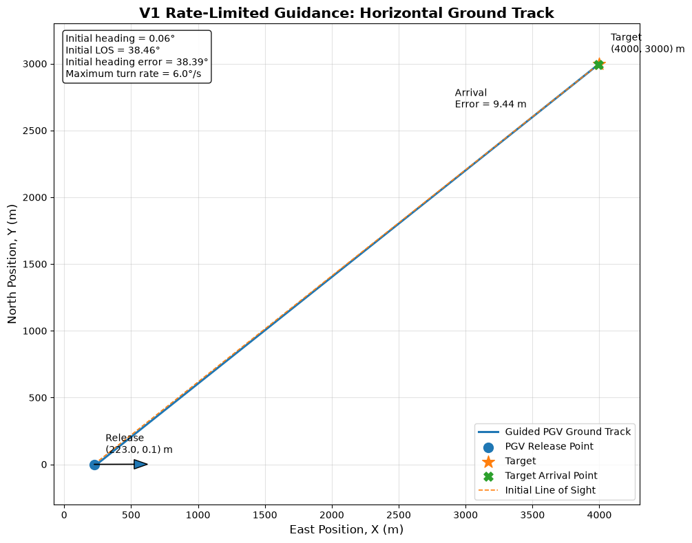
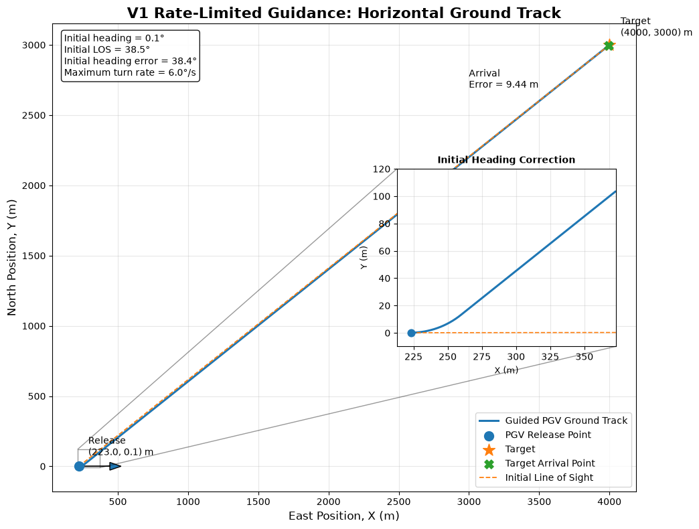
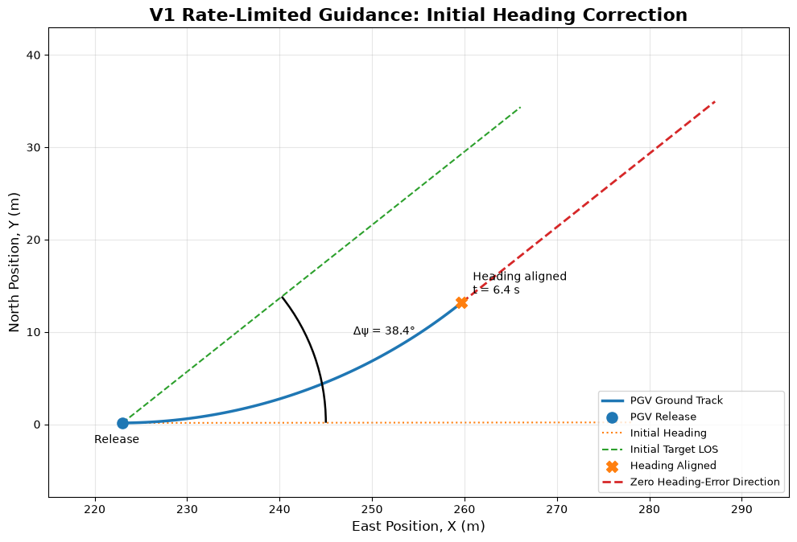
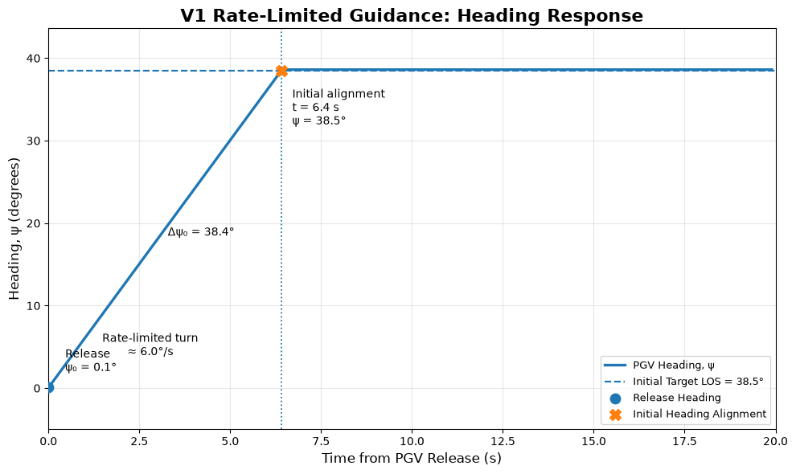
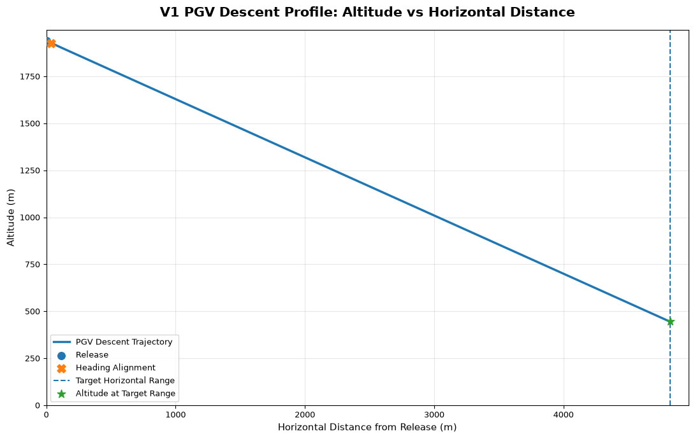
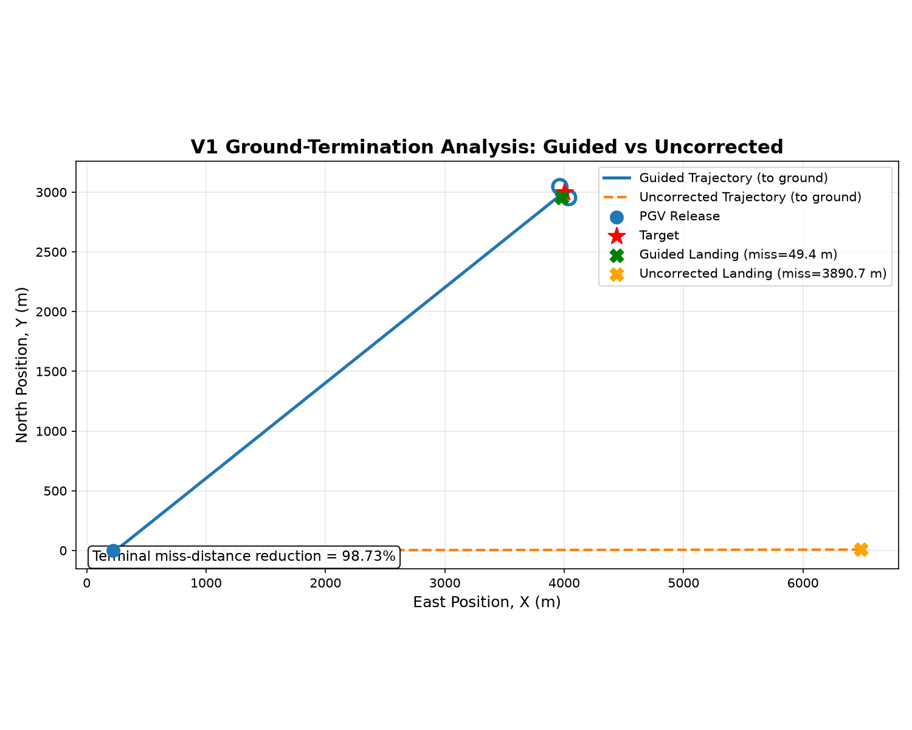

# Payload Glide Vehicle Guidance

This directory contains the **Guidance, Navigation and Control (GNC) proof-of-concept** for the Payload Glide Vehicle (PGV) developed as part of **RAPID — Rocket Assisted Payload Insertion and Descent**.

The launch vehicle provides the PGV with an initial separation state near apogee. Following separation, the PGV autonomously navigates toward a stationary ground target.

```text
Rocket-Provided Separation State
              │
              ▼
     V0 — Mission Feasibility
              │
              ▼
   V1 — Baseline Guidance
              │
              ▼
Future — Robustness & Higher-Fidelity GNC
```

> **Correction note:** This README has been updated to (1) correct the documented guidance-law gain, which previously did not match the implemented code, and (2) add the Ground-Termination Analysis code that was referenced in results tables but missing from the notebook. All values below were regenerated from a single, full-precision execution of the corrected notebooks against `release_states_data_clean.csv` — see [Data Source & Precision Note](#data-source--precision-note) at the end of this document.

---

# Mission Scenario

| Parameter | Value |
|---|---:|
| Target X position | 4000.00 m |
| Target Y position | 3000.00 m |
| Target range from launch origin | 5000.00 m |
| Separation altitude | 1939.57 m |
| Separation X position | 223.01 m |
| Separation Y position | 0.14 m |
| Target type | Stationary |
| Launch profile | Vertical |
| PGV configuration | Steerable parafoil |
| PGV + payload mass | 0.50 kg |

Coordinate system: East-North-Up.

```text
X → East
Y → North
Z → Up
```

Target = (4000.00, 3000.00, 0.00) m

---

# PGV Baseline Model

| Parameter | Symbol | Value |
|---|---|---:|
| Horizontal speed | Vh | 6.20 m/s |
| Sink rate | Vd | 1.92 m/s |
| Glide ratio | Vh / Vd | 3.23 : 1 |
| Maximum heading rate | ψ̇max | 6.00 °/s (0.1047 rad/s) |
| Minimum turn radius | Vh / ψ̇max | 59.22 m |
| PGV + payload mass | m | 0.50 kg |

> **Validation status:** provisional modelling assumptions for proof-of-concept development, not yet validated against a specific 500 g-class PGV hardware configuration.

---

# Model Assumptions

- Point-mass PGV dynamics
- Constant horizontal speed and sink rate
- Stationary target, flat terrain, no wind
- No sensor noise, no navigation uncertainty, no actuator lag
- No detailed aerodynamic model
- Perfect state knowledge

---

# V0 — Mission Feasibility

**Notebook:** `mission_feasibility.ipynb`

> **Fix applied:** the notebook previously had no code cell between the "Mission Feasibility Check" and "Checking PGV remaining altitude" headers — `xT`, `yT`, `Vh`, `Vz`, `D`, and `D_max` were referenced but never defined, so a fresh run would fail with `NameError`. The missing cell has been restored; the notebook now runs top-to-bottom without error, and was independently re-executed to confirm this.

## Objective

> **Does the available separation altitude and assumed PGV glide capability provide sufficient horizontal range to reach the nominal 5 km target?**

V0 assumes ideal initial alignment toward the target and therefore evaluates **mission reachability**, not guidance performance.

## Result

| Quantity | Value |
|---|---:|
| Separation altitude | 1939.57 m |
| Horizontal distance to target | 4823.36 m |
| Available flight time | 1010.19 s |
| Maximum theoretical horizontal range | 6263.20 m |
| Theoretical range margin | 1263.20 m |

**The nominal 5 km mission is reachable under the simplified idealized assumptions.**

## Figures





---

# V1 — Baseline Guidance

**Notebook:** `baseline_guidance.ipynb`

## Objective

V1 introduces the real, imperfect rocket-provided separation heading and evaluates whether the PGV can correct its trajectory toward the stationary target.

## Initial Separation Geometry

| Quantity | Value |
|---|---:|
| Separation X position | 223.01 m |
| Separation Y position | 0.14 m |
| Separation altitude | 1939.57 m |
| Initial PGV heading | 0.07° |
| Initial bearing to target | 38.46° |
| Initial heading error | 38.39° |

## Guidance Model

Kinematic motion model:

```text
dx/dt = Vh cos(ψ)
dy/dt = Vh sin(ψ)
dz/dt = −Vd
```

Instantaneous target bearing:

```text
bearing = atan2(yT − y, xT − x)
heading_error = wrap(bearing − ψ)
```

Commanded heading rate:

```text
ψ̇cmd = clamp(heading_error / Δt, −ψ̇max, +ψ̇max)
```

with `Δt = 0.1 s`, `ψ̇max = 6.00 °/s`.

> **Correction:** earlier documentation described this law as `ψ̇cmd = clamp(Kp × heading_error, ±ψ̇max)` with `Kp = 1.00`. The implemented code actually computes `heading_error / Δt`, which is equivalent to an effective proportional gain of `Kp = 1/Δt = 10`, not 1. This has been corrected here to describe what the code actually does. The numerical results are unaffected — with either formulation, the commanded rate saturates to `ψ̇max` whenever the heading error is more than a fraction of a degree, so the controller behaves as a bang-bang (rate-saturated) correction in both cases, not a gentle proportional response.

Because the target is stationary, this is the heading-error-nulling reduction of Proportional Navigation — the LOS rotation observed here is caused entirely by the PGV's own motion, not by target motion, so nulling the heading error is equivalent to nulling the LOS rate in this special case. A moving-target mission would require reintroducing full closing-velocity-weighted PN (see Future Development).

## Initial Heading Correction Results

| Quantity | Value |
|---|---:|
| Correction completion time | 6.40 s |
| Position at heading alignment | (259.77, 12.98) m |
| Altitude at heading alignment | 1927.29 m |
| Altitude lost during correction | 12.29 m |
| Final heading error | 0.00° |

## Figures








---

# Target-Vicinity Result

The guidance loop stops once the PGV enters a 10 m capture radius around the target — this happens while the PGV is still well above ground.

| Quantity | Value |
|---|---:|
| Time at target vicinity | 776.90 s |
| Horizontal range error | 9.44 m |
| Altitude at target vicinity | 447.92 m |

This is a **horizontal target-vicinity metric**, not a landing miss distance — the PGV still has 447.92 m of altitude remaining at this point.

---

# Ground-Termination Analysis

> **Fix applied:** this section's results were previously presented in the README/report without any corresponding code in the notebook — there was no cell that propagated a guided and an uncorrected case to `z = 0` and compared them. This has been added as a new, fully executed and verified cell (`# GROUND-TERMINATION ANALYSIS`) at the end of `baseline_guidance.ipynb`.

A separate propagation of the same guidance model (not stopping at the 10 m target-vicinity tolerance) is run to `z = 0`, alongside an uncorrected case that holds the initial separation heading fixed for the entire flight.

| Quantity | Guided | Uncorrected |
|---|---:|---:|
| Terminal X | 3977.91 m | 6486.20 m |
| Terminal Y | 2955.80 m | 7.24 m |
| Ground miss distance | **49.42 m** | **3890.74 m** |
| Flight time | 1010.20 s | 1010.19 s |

**Terminal miss-distance reduction: 98.73%**



> **Metric distinction:** the 9.44 m result above is horizontal target-vicinity error at 447.92 m altitude; the 49.42 m result here is horizontal miss distance when separately propagated to ground level. These are two different, independently valid metrics — one is not a rounding of the other.

---

# Current Limitations

- Wind and atmospheric disturbances not modelled
- No sensor noise, navigation uncertainty, or actuator lag
- No detailed parafoil aerodynamics, bank dynamics, or payload pendulum coupling
- No terrain variation
- No closed-loop state estimation
- PGV parameters are provisional, not hardware-validated

---

# Future Development

- **Sensitivity analysis** — vary separation altitude, position, and initial heading
- **Monte Carlo / CEP analysis** — introduce uncertainty, evaluate miss-distance distributions
- **Wind and disturbance modelling**
- **Higher-fidelity PGV dynamics** — bank dynamics, variable sink rate, aerodynamic coupling
- **Moving-target extension** — reintroduce full closing-velocity-weighted Proportional Navigation for a non-stationary target (e.g. naval resupply / VERTREP-style delivery), building on prior moving-target PN work in the author's separate exploratory guidance repository
- **Navigation and control** — sensor modelling, state estimation, Extended Kalman filtering, actuator dynamics
- **MATLAB cross-verification**

---

# Data Source & Precision Note

All values in this document were computed in a single, full-precision pass from `release_states_data_clean.csv` and are internally consistent with each other and with the executed notebooks. Earlier versions of this documentation mixed values computed from the raw (uncleaned) CSV with values from the cleaned CSV, and in places used a rounded, previously-displayed value (e.g. ψ₀ rounded to 0.10°) as an input to a later calculation instead of the full-precision value (0.065°) — this produced small (<0.1°, <3 m) inconsistencies across tables. Going forward, only `release_states_data_clean.csv` should be used, and all intermediate calculations should carry full floating-point precision through to the final rounding step for display.

---

# Directory Structure

```text
02_pgv_guidance/
│
├── mission_feasibility.ipynb
├── baseline_guidance.ipynb
│
├── v0_mission_geometry_3d.png
├── v0_horizontal_mission_geometry.png
├── v0_altitude_vs_horizontal_distance.png
│
├── v1_mission_geometry_3d.png
├── v1_horizontal_mission_geometry.png
├── v1_horizontal_mission_geometry_magnified.png
├── v1_heading_correction.png
├── v1_heading_vs_time.png
├── v1_altitude_vs_horizontal_distance.png
├── v1_range_vs_time.png
│
└── README.md
```

---

# Status

**Current Stage: GNC Proof-of-Concept**

- A theoretically feasible 5 km mission under the assumed PGV glide model
- A rocket-provided separation altitude of 1939.57 m
- Recovery from a 38.39° initial heading mismatch, completed in 6.40 s
- Horizontal target-vicinity error of 9.44 m at 447.92 m altitude
- A verified guided ground miss distance of 49.42 m
- A verified uncorrected ground miss distance of 3890.74 m
- A 98.73% reduction in terminal miss distance under the baseline model, now backed by executable, re-run code

The implementation remains a simplified engineering proof-of-concept, providing a baseline for future robustness analysis and higher-fidelity PGV guidance development.
