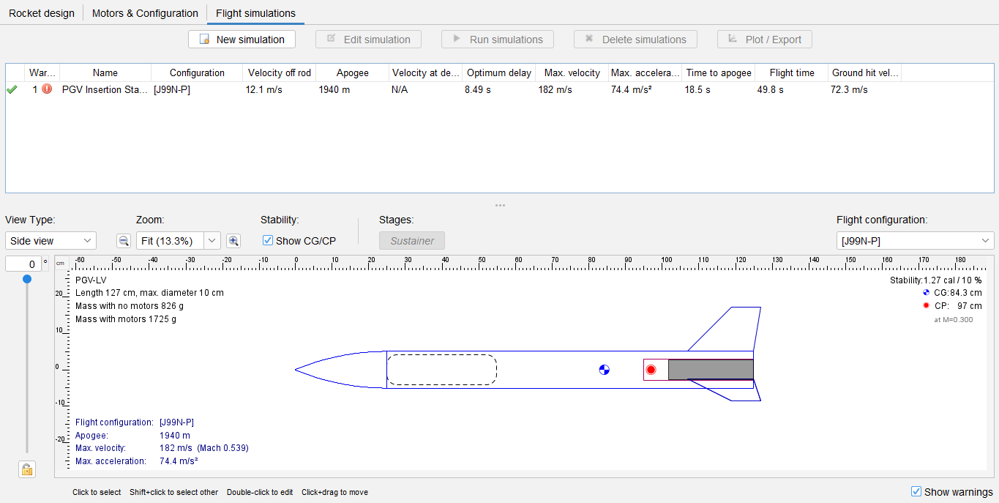

# RAPID — Precision Delivery

**Rocket-Assisted Payload Insertion and Descent**

RAPID is a concept development project for **rocket-assisted point-to-point payload delivery**, in which a launch vehicle inserts a **Payload Glide Vehicle (PGV)** to altitude and the PGV subsequently performs guided descent toward a designated ground target.

The current repository focuses on the **Guidance, Navigation and Control (GNC) subsystem** of the PGV, supported by rocket sizing and trajectory analysis.

> **Project status:** Proof-of-concept simulation. Current results are modelling results and are not hardware validation or flight-ready performance claims.

---

## 1. Concept Overview

The RAPID concept separates the mission into two primary functions:

```text
Rocket Launch
      ↓
Altitude Insertion
      ↓
PGV Separation
      ↓
Autonomous Guidance
      ↓
Guided Glide
      ↓
Target Delivery
```

The **launch vehicle** provides the required insertion altitude and initial state.

The **Payload Glide Vehicle (PGV)** performs the post-separation navigation, guidance and controlled glide toward the target.

The present work concentrates on establishing a baseline GNC simulation before introducing higher-fidelity vehicle dynamics and environmental uncertainties.

---

## 2. Mission Scenario

| Parameter | Value |
|---|---:|
| Target type | Stationary |
| Target position | (4000.00, 3000.00, 0.00) m |
| Target range | 5000.00 m |
| PGV + payload mass | 0.50 kg |
| Launch profile | Vertical |
| Baseline PGV | Steerable parafoil |
| Rocket role | Altitude insertion |
| PGV role | Guided descent and delivery |

Coordinate convention:

```text
X → East
Y → North
Z → Up
```

---

## 3. Current Project Status

| Component | Status |
|---|---|
| Rocket sizing | ✅ Completed |
| OpenRocket simulation | ✅ Completed |
| PGV mission feasibility (V0) | ✅ Completed |
| Baseline guidance (V1) | ✅ Completed |
| Python implementation | ✅ Completed |
| MATLAB implementation | ⏳ Planned |
| Sensitivity analysis | ⏳ Planned |
| Monte Carlo / CEP analysis | ⏳ Planned |
| Wind and disturbance modelling | ⏳ Planned |
| Higher-fidelity PGV dynamics | ⏳ Planned |
| Navigation / state estimation | ⏳ Planned |

---

## 4. System Architecture

```text
┌─────────────────────────────┐
│       Launch Vehicle        │
│                             │
│  Rocket Sizing              │
│  Trajectory Simulation      │
│  Altitude Insertion         │
└──────────────┬──────────────┘
               │
               │ Separation State
               ▼
┌─────────────────────────────┐
│     Payload Glide Vehicle   │
│                             │
│  Navigation                 │
│  Guidance                   │
│  Control                    │
│  Guided Glide               │
└──────────────┬──────────────┘
               │
               ▼
         Target Area
```

The current implementation treats the PGV primarily as a **point-mass guided glide vehicle**, allowing the guidance problem to be investigated independently of detailed aerodynamic and structural modelling.

---

## 5. Current GNC Demonstration

The baseline V1 implementation uses a **continuously updated, turn-rate-limited pursuit guidance law**.

The PGV continuously calculates the bearing to the stationary target, determines the heading error, and commands a bounded heading rate.

The current baseline produces the following results:

| Metric | Result |
|---|---:|
| Rocket apogee | **1939.57 m** |
| Maximum theoretical PGV range | **6263.20 m** |
| Nominal mission range | **5000.00 m** |
| Initial heading error | **38.39°** |
| Heading correction time | **6.40 s** |
| Guided ground miss | **49.42 m** |
| Uncorrected ground miss | **3890.74 m** |
| Terminal miss-distance reduction | **98.73%** |

The simulation therefore demonstrates that the baseline guidance law can substantially reduce terminal miss distance relative to the corresponding uncorrected trajectory under the same simplified model.

> The **98.73% reduction** is a model-to-model comparison, not a claim of real-world delivery accuracy.

---

## 6. Representative Results

### Rocket Configuration



### Mission Feasibility


### Baseline Guided Trajectory


Detailed plot sets and simulation notebooks are available in [`02_pgv_guidance/`](02_pgv_guidance/).

---

## 7. Repository Structure

```text
RAPID_precision_delivery/
│
├── README.md
│
├── 01_rocket_sizing/
│   ├── rapid_pgv_lv.ork
│   ├── README.md
│   ├── release_states_data.csv
│   ├── release_states_data_clean.csv
│   └── rocket_configuration.png
│
├── 02_pgv_guidance/
│   ├── baseline_guidance.ipynb
│   ├── mission_feasibility.ipynb
│   ├── README.md
│   ├── v0_altitude_vs_horizontal_distance.png
│   ├── v0_horizontal_mission_geometry.png
│   ├── v0_mission_geometry_3d.png
│   ├── v1_altitude_vs_horizontal_distance.png
│   ├── v1_heading_correction.png
│   ├── v1_heading_correction_magnified.png
│   ├── v1_heading_vs_time.png
│   ├── v1_horizontal_mission_geometry.png
│   └── v1_mission_geometry_3d.png
│
├── 03_report/
│   └── README.md
│
└── requirements.txt
```

### Module Guide

| Directory | Purpose |
|---|---|
| [`01_rocket_sizing/`](01_rocket_sizing/) | Rocket configuration, motor selection and OpenRocket analysis |
| [`02_pgv_guidance/`](02_pgv_guidance/) | PGV mission feasibility, guidance simulation and trajectory analysis |
| [`03_report/`](03_report/) | Consolidated technical report |
| [`requirements.txt`](requirements.txt) | Python dependencies |

---

## 8. Technology Stack

**Rocket simulation:** OpenRocket

**Programming:** Python

**Numerical computing:** NumPy, SciPy

**Visualization:** Matplotlib

**Documentation:** Markdown, Jupyter Notebook

**Planned:** MATLAB implementation and cross-verification

---

## 9. Modelling Scope

The current PGV baseline uses:

- Point-mass dynamics
- Constant horizontal velocity
- Constant sink rate
- Stationary target
- Flat terrain
- No wind
- No atmospheric disturbances
- Perfect state knowledge
- No sensor noise
- No actuator lag
- Simplified parafoil representation

These assumptions are intentional: the current phase isolates the baseline guidance problem before introducing additional uncertainty and vehicle dynamics.

---

## 10. Development Roadmap

```text
[✓] Rocket sizing
     ↓
[✓] Mission feasibility (V0)
     ↓
[✓] Baseline guidance (V1)
     ↓
[→] Sensitivity analysis
     ↓
[ ] Monte Carlo / CEP
     ↓
[ ] Wind & disturbance modelling
     ↓
[ ] Higher-fidelity PGV dynamics
     ↓
[ ] Navigation & state estimation
     ↓
[ ] MATLAB cross-verification
```

---

## 11. Documentation

### Rocket Sizing

[`01_rocket_sizing/`](01_rocket_sizing/)

Vehicle configuration, OpenRocket setup, candidate motors and insertion-state analysis.

### PGV Guidance

[`02_pgv_guidance/`](02_pgv_guidance/)

Detailed V0 mission-feasibility analysis, V1 baseline guidance, equations, trajectory plots and terminal analysis.

### Technical Report

[`03_report/`](03_report/)

Consolidated engineering documentation covering the mission concept, rocket insertion, PGV modelling, guidance approach, results, limitations and future development.

---

## 12. Project Status

RAPID is an **ongoing engineering concept-development project**.

The current repository establishes a baseline workflow from:

**rocket sizing → insertion state → PGV mission feasibility → baseline guidance → terminal analysis**

Future development will focus on uncertainty, disturbances, higher-fidelity dynamics and navigation/control modelling.

> **Disclaimer:** Numerical results in this repository are simulation results generated under explicitly stated assumptions. They should not be interpreted as validated operational, safety, or flight-performance characteristics.